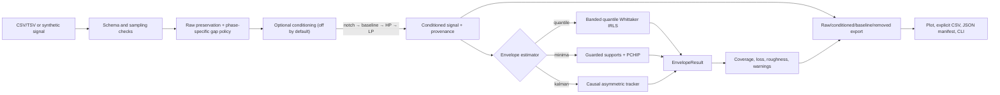
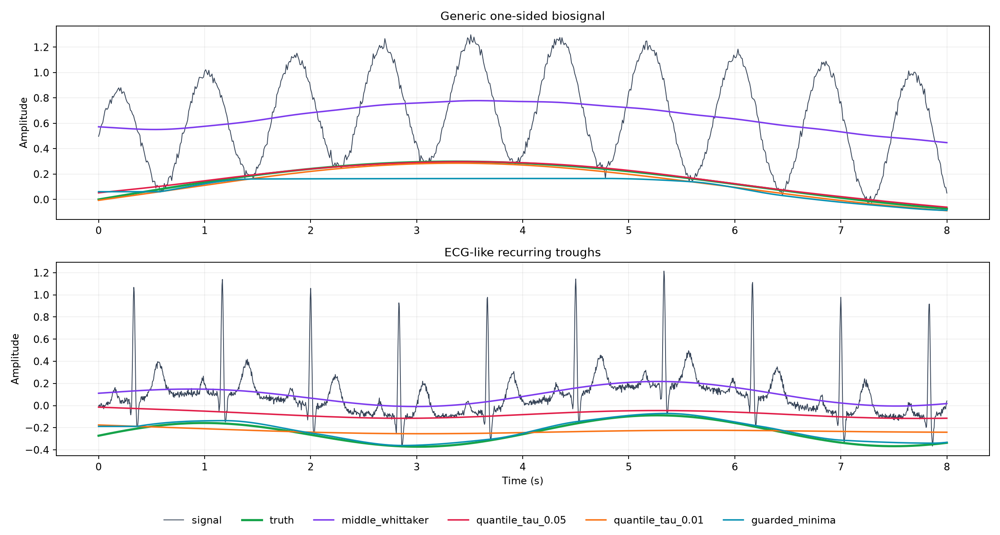
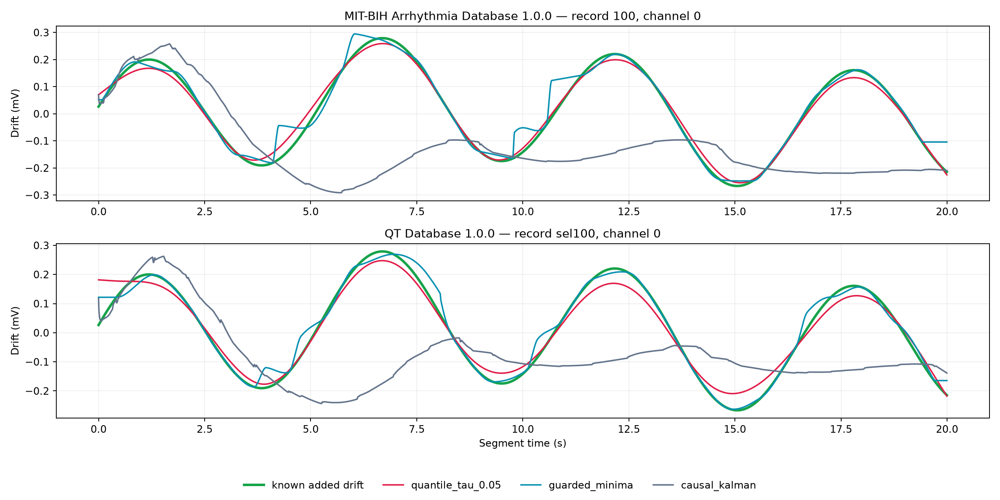

# Lower-Point Approximation of Biosignals

## Development and implementation report

**Project:** LowPoint Biosignal Lab  
**Version:** 0.1.0 research prototype  
**Date:** 12 July 2026  
**Primary example:** electrocardiogram (ECG)  
**Status:** implemented, tested, benchmarked, and browser-smoke-tested; not clinically validated

---

## 1. Executive summary

The requested operation—approximating a biosignal at its lowest region rather than through its
middle—has been implemented as a reusable scientific Python package and an interactive local
application.

The central result of the analysis is that “lowest approximation” has at least three different
technical meanings:

1. a **smooth low statistical envelope**, such as the 5th conditional quantile;
2. a **trajectory through recurring trough events**, such as one Q/S-like minimum per ECG cycle;
3. the **ECG isoelectric baseline**, the physiological reference used for baseline-wander
   correction.

These objects are not interchangeable. In particular, ECG Q and S troughs are cardiac
depolarization features, not baseline samples. Connecting them produces a valid numerical trough
trajectory, but not the ECG isoelectric level. Classical ECG spline correction deliberately uses
PR/isoelectric samples, and improved morphological algorithms first remove QRS influence. This
distinction is supported by [Meyer and Keiser](https://doi.org/10.1016/0010-4809(77)90021-0) and
[Sun et al.](https://doi.org/10.1109/TBME.2002.805486).

The v0.1 application therefore implements and clearly labels three modes:

- **Penalized quantile smoother** — the recommended generic lower-envelope estimator. It targets
  a selected low quantile rather than the mean or median, is smooth, scale-normalized, and has
  bounded sensitivity to the magnitude of a single negative outlier.
- **Guarded block minima with PCHIP** — the literal lowest-point reference. It selects one
  short-median-guarded minimum per overlapping window, rejects amplitude-inconsistent supports,
  and uses shape-preserving interpolation.
- **Asymmetric Kalman tracker** — an experimental expectile-like local-linear tracker, not an exact
  quantile estimator. It is causal after initialization, but the default 2 s warm-up estimates its
  initial level from future startup samples; zero warm-up removes that startup lookahead. Its weak
  validation results show that it should not be the default.

The deliverable includes:

- a Streamlit/Plotly application with synthetic ECG and CSV/TSV input;
- a UI-independent scientific core;
- optional, disabled-by-default signal conditioning with mains notches/harmonics, Butterworth
  high-pass and low-pass filters, numerical baseline removal, and offline/causal phase modes;
- lower and upper envelopes via exact sign duality;
- explicit raw/conditioned coordinate systems, missing-value provenance, support points,
  diagnostics, and export;
- a command-line interface;
- 72 automated tests;
- 100 synthetic method/scenario benchmark runs;
- additive-drift smoke tests on streamed PhysioNet MIT-BIH and QT ECG segments;
- machine-readable validation tables and figures;
- a locked `uv` environment and reproducibility manifest support.

The strongest measured findings are:

- On the generic one-sided synthetic biosignal, the 5% quantile method achieved mean RMSE
  **0.0093**, compared with **0.4689** for a conventional middle Whittaker smoother.
- On the synthetic recurring ECG trough target, guarded minima achieved mean RMSE **0.0234**,
  compared with **0.3355** for the middle smoother.
- On two real ECG segments with a known added drift, the quantile method recovered the drift with
  RMSE **0.0189 mV** (MIT-BIH record 100) and **0.0315 mV** (QT record `sel100`). These are small
  smoke tests, not clinical validation.
- All 72 tests and all lint checks pass. Browser tests covered the built-in ECG path, both primary
  offline estimators, file upload, result refresh, charts, diagnostics, and export controls with no
  console errors or warnings.

The immediate recommendation is:

- use the **quantile** method for a robust, smooth generic lower outline;
- use **minima** mode when the scientific target is explicitly a recurring trough trajectory;
- keep signal conditioning disabled unless a documented interference-removal requirement justifies
  it, and interpret every envelope in the resulting conditioned coordinate system;
- do not subtract either result from diagnostic ECG and call it “baseline correction”;
- build a separately named, QRS-gated PR/TP estimator before any physiological ECG baseline claim.

---

## 2. Problem definition

### 2.1 Signal model

Write an observed biosignal as

\[
y(t)=s_{\mathrm{bio}}(t)+b(t)+\varepsilon(t)+a(t),
\]

where:

- \(s_{\mathrm{bio}}\) is the physiological waveform;
- \(b\) is an additive slowly varying acquisition baseline or drift;
- \(\varepsilon\) is ordinary measurement noise;
- \(a\) represents intermittent artifact, clipping, motion, or electrode disturbance.

A centerline smoother estimates a conditional mean, median, or slowly varying trend through the
middle of \(y\). The requested output is instead a low outline \(L(t)\). That outline still needs a
formal target.

### 2.2 Three targets that must remain separate

#### A. Low conditional quantile

For \(0<\tau<0.5\), define

\[
L_\tau(t)=Q_\tau\{Y(t)\mid t\}.
\]

Approximately a fraction \(\tau\) of observations should lie below this curve. This is a
statistical lower edge; it is well-defined in the presence of noise.

#### B. Recurring trough trajectory

Let \((t_k,v_k)\) be one scientifically defined trough per cycle, beat, or region of interest.
Then estimate a smooth trajectory through those events:

\[
T(t_k)\approx v_k.
\]

This is suitable for monitoring S-wave depth, pulse trough amplitude, respiratory minima, or other
cycle-specific low features. The definition of the cycle and region is part of the target.

#### C. ECG isoelectric baseline

The isoelectric baseline is an additive reference inferred from electrically quiet ECG segments,
typically PR/PQ or TP evidence. It is not the numerical minimum of a beat. Q and S deflections,
negative T waves, ST depression, and inverted leads can all be below the isoelectric level while
remaining clinically meaningful physiology.

This project implements A and a generic form of B. It explicitly does **not** claim to implement C.

### 2.3 Why the literal minimum is unstable

For \(N\) independent zero-mean Gaussian noise samples with standard deviation \(\sigma\), the
expected minimum is approximately

\[
E[\min_i\varepsilon_i]\approx-\sigma\sqrt{2\log N}.
\]

Consequently, increasing the sample rate or window length moves a rolling minimum downward even if
the underlying physical signal is unchanged. A single negative impulse can control a whole
minimum window. “Lowest” should therefore normally mean a low quantile or a robustly defined event,
not \(\tau=0\).

There is a second unavoidable offset. If \(Y(t)=b(t)+\varepsilon(t)\) and the noise is symmetric,

\[
Q_\tau(Y(t))=b(t)+F_\varepsilon^{-1}(\tau).
\]

For Gaussian noise, a 5% lower quantile lies about \(1.645\sigma\) below the noise center. A
statistical lower envelope is therefore not an unbiased estimate of the physical baseline even
when no physiological waveform is present.

---

## 3. Literature and method analysis

### 3.1 Mean and Whittaker smoothing

Ordinary penalized least squares solves

\[
\hat z=\arg\min_z\|y-z\|_2^2+\lambda\|D^2z\|_2^2.
\]

It is computationally attractive and produces a smooth centerline, but squared symmetric loss
targets the middle of the data. Eilers provides the efficient Whittaker-smoothing construction
used as the numerical foundation for the difference penalty
([Eilers, 2003](https://doi.org/10.1021/ac034173t)). It is the correct comparator for the user's
statement that ordinary approximation passes through the middle.

### 3.2 Quantile regression and quantile smoothing splines

Regression quantiles replace symmetric squared loss with the asymmetric check loss

\[
\rho_\tau(r)=r\left(\tau-\mathbf 1_{r<0}\right).
\]

For a constant fit, minimizing \(\sum_i\rho_\tau(y_i-z)\) gives a sample \(\tau\)-quantile.
[Koenker and Bassett](https://doi.org/10.2307/1913643) established regression quantiles, and
[Koenker, Ng, and Portnoy](https://doi.org/10.1093/biomet/81.4.673) developed quantile smoothing
splines. This is the most direct mathematical answer to “fit low rather than in the middle.”

The key robustness benefit is that check loss grows linearly with residual magnitude. A deep
negative impulse still has influence, but its effect does not grow quadratically as in least
squares.

### 3.3 Asymmetric least squares and expectiles

Asymmetric least squares uses different squared-error weights above and below the curve:

\[
\min_z\sum_iw_i(y_i-z_i)^2+\lambda\|D^2z\|_2^2.
\]

This is fast and widely used for analytical-spectroscopy baselines, including the
[Eilers–Boelens AsLS report](https://prod-dcd-datasets-public-files-eu-west-1.amazonaws.com/dd7c1919-302c-4ba0-8f88-8aa61e86bb9d).
However, asymmetric squared loss estimates an **expectile**, not a quantile
([Newey and Powell](https://doi.org/10.2307/1911031)). A parameter value of 0.05 does not imply
that 5% of observations lie below the curve. Deep negative Q/S waves and motion impulses also
retain squared leverage. AsLS was therefore not chosen as the default ECG-facing method.

### 3.4 Mathematical morphology

For a one-dimensional signal and a flat structuring element \(B\), erosion and dilation are

\[
(y\ominus B)[n]=\min_{k\in B}y[n+k],\qquad
(y\oplus B)[n]=\max_{k\in B}y[n-k].
\]

Opening, \(y\circ B=(y\ominus B)\oplus B\), is anti-extensive and behaves like a fast lower
envelope. It is attractive for streaming, but the structuring-element duration defines what is
removed, and morphology can introduce plateaus or rectangular distortion. The foundational ECG
application is [Chu and Delp](https://doi.org/10.1109/10.16474). Critically, the improved method of
[Sun et al.](https://doi.org/10.1109/TBME.2002.805486) removes QRS and impulsive influence before
estimating background. This is direct evidence that unqualified ECG minima should not define a
physiological baseline.

### 3.5 Local minima and interpolation

Connecting local minima is intuitive and explainable. Ordinary cubic interpolation can overshoot
between knots and is not guaranteed to remain below the samples. The implementation uses PCHIP,
whose shape-preserving construction comes from
[Fritsch and Carlson](https://doi.org/10.1137/0717021). PCHIP reduces interpolation overshoot, but
it still does not create a hard minorant relative to all unsampled points.

An ECG peak-envelope study demonstrated that an interpolated **upper** peak family can approximate
baseline drift under its stated assumptions
([Ouali, Ghanai, and Chafaa](https://doi.org/10.3906/elk-1705-165)). A lower Q/S analogue is a
reasonable research hypothesis, but it is an inference; that paper does not validate a lower
envelope as the isoelectric baseline.

### 3.6 Empirical mode decomposition

Classical EMD constructs cubic upper and lower extrema envelopes, averages them, and iteratively
sifts intrinsic mode functions
([Huang et al.](https://doi.org/10.1098/rspa.1998.0193)). The direct lower extrema spline is not the
EMD baseline. EMD trend candidates are the slow final residue or selected low-frequency modes.
Endpoint behavior, mode mixing, extrema selection, and spline intersections make EMD a useful
comparator rather than the simplest first production method.

### 3.7 ECG baseline-wander correction

ECG baseline wander overlaps clinically meaningful low-frequency ST/T content. Classical
PR-segment spline work deliberately uses isoelectric evidence
([Meyer and Keiser](https://doi.org/10.1016/0010-4809(77)90021-0)); subsequent work documents spline
implementation and distortion limitations
([Froning, Olson, and Froelicher](https://doi.org/10.1016/0022-0736(88)90083-0)).

The AHA/ACCF/HRS technology statement discusses how filter choices can change amplitudes,
durations, and particularly ST behavior
([Kligfield et al.](https://doi.org/10.1016/j.jacc.2007.01.024)). This supports the project's
decision to keep “lower envelope” separate from “isoelectric baseline correction” in naming,
plots, exports, and warnings.

### 3.8 Kalman/state-space interpretation

A standard linear-Gaussian Kalman filter uses a symmetric quadratic likelihood and estimates a
conditional mean. Tuning its covariance does not turn it into a quantile estimator.

The offline quantile smoother has a useful state-space MAP interpretation:

\[
z_i=2z_{i-1}-z_{i-2}+\nu_i,
\]

with Gaussian second-difference process noise and an asymmetric-Laplace observation likelihood.
Its MAP objective is pinball fidelity plus a quadratic second-difference penalty. Exact online
inference is therefore non-Gaussian; a fixed-lag convex solver or asymmetric-Laplace filter is the
correct future direction.

The included Kalman mode is intentionally described as an approximate expectile-like tracker. Its
weak validation performance confirms that it should remain experimental.

---

## 4. Implemented algorithm specification

### 4.1 Signal preparation and optional conditioning

The public workflow accepts a one-dimensional, effectively uniformly sampled signal and a sampling
rate in hertz. It separates finite-value preparation, optional acquisition-noise conditioning, and
envelope estimation so that filtering can never be mistaken for part of the lower-envelope
objective.

#### Mandatory finite-value preparation

Both public entry points convert to 64-bit floating point without mutating the caller's array,
require at least five samples and at least three finite values, and retain an exact `valid_mask`.
With the offline/default preparation policy, missing interior values are linearly interpolated and
missing endpoints use the nearest finite value. The envelope metrics combine this mask with any
mask supplied by an earlier conditioning step, so filled samples are not counted as observations.
The same combined mask is passed into guarded support extraction: a block with no originally valid
sample is skipped, and an interpolated or forward-filled sample can never be returned or plotted as
a low-point support.

Robust standardization is estimator-specific rather than universal. The quantile and Kalman modes
use

\[
x_i=\frac{y_i-m}{s},\qquad
m=\operatorname{median}(y),\quad
s=1.4826\operatorname{MAD}(y),
\]

with IQR, standard deviation, and finally 1.0 as ordered fallbacks for a degenerate scale. This
gives translation and positive-scale equivariance and makes their numerical tolerances and Kalman
covariances mostly independent of signal units. Guarded-minima/PCHIP operates directly in the
prepared signal's amplitude units.

#### Disabled-by-default conditioning

`preprocess_signal(..., SignalFilterConfig(...))` implements explicit optional conditioning. Every
stage is off by default; therefore a finite signal passes through unchanged unless the caller or UI
enables a stage. The fixed order is:

1. one or more second-order IIR notches at the selected mains fundamental and its requested
   harmonics below Nyquist;
2. one numerical baseline-removal method: moving median or Butterworth high-pass;
3. a general Butterworth high-pass;
4. a general Butterworth low-pass.

| Conditioning control | Default | Behavior when enabled |
|---|---:|---|
| `phase_mode` | `zero_phase` | Offline forward/backward IIR or single-pass `causal` processing |
| `mains_enabled` | `False` | Notch at `mains_frequency_hz`; 50, 60, and custom Hz are exposed in the UI |
| `mains_quality_factor` | 30 | Notch selectivity; larger (Q) is narrower |
| `mains_harmonics` | 1 | Sequential harmonics; frequencies at/above Nyquist are skipped and reported |
| `baseline_method` | `none` | `median` or `highpass`; these are numerical transforms, not physiological claims |
| `baseline_window_seconds` | 0.8 s | Odd moving-median window |
| `baseline_cutoff_hz`, `baseline_order` | 0.5 Hz, 2 | Butterworth high-pass used as the baseline-removal stage |
| `highpass_enabled` | `False` | General high-pass; default configured cutoff/order are 0.5 Hz/2 per pass |
| `lowpass_enabled` | `False` | General low-pass; default configured cutoff/order are 40 Hz/4 per pass |

The fundamental notch and all enabled cutoffs must lie strictly below Nyquist. Harmonics that cross
Nyquist are skipped with their frequencies recorded. Enabling both baseline high-pass and general
high-pass is allowed but generates a warning because their attenuation compounds. Records with
fewer than three cycles at a high-pass cutoff also generate an edge/transient warning.

No filter is silently activated. High-pass, low-pass, notch, and median operations can all change
the waveform and the scientific target, so they require an explicit configuration and separate
application validation.

#### Phase and missing-data semantics

In `zero_phase` mode, IIR stages use forward/backward second-order-section filtering. This removes
phase shift but uses future data and doubles each stage's effective order. A centered median uses
reflected boundary samples. Signals too short for the required forward/backward padding are
rejected rather than silently processed differently.

In `causal` mode, IIR stages are single-pass and initialized at the first sample; moving-median
baseline removal uses a trailing window. Interior gaps are forward-filled, and a leading gap is
rejected because filling it would require future information. Causal filtering still has phase lag
and startup transients. Offline linear gap interpolation, centered medians, and forward/backward
filters are not causal.

#### Coordinate and provenance contract

`SignalFilterResult` returns `raw_signal`, finite `prepared_signal`, final `processed_signal`, the
baseline-stage estimate, the total removed component, the original `valid_mask`, full configuration,
and stage diagnostics. The total removed component is

\[
r_{\mathrm{removed}}=y_{\mathrm{prepared}}-y_{\mathrm{processed}},
\]

so it includes all enabled stages and is not generally identical to `baseline_estimate`. The
envelope estimator receives `processed_signal`; consequently its approximation and residual live in
conditioned coordinates:

\[
r_{\mathrm{envelope}}=y_{\mathrm{processed}}-\hat L(y_{\mathrm{processed}}).
\]

The app, CSV headers, manifest, and plots use these explicit names. Synthetic truth RMSE is shown
only when conditioning is inactive, because activating a filter changes the target coordinate.

### 4.2 Primary method: penalized quantile Whittaker smoother

The ideal discrete objective is

\[
\hat z=\arg\min_z
\left[
\sum_{i=1}^{N}\rho_\tau(x_i-z_i)
+\frac{\lambda}{2}\|D^2z\|_2^2
\right],
\]

where \(D^2\) is the second-difference operator with rows \([1,-2,1]\).

The implementation uses the differentiable approximation

\[
\tilde\rho_{\tau,\epsilon}(r)
=\frac12\sqrt{r^2+\epsilon^2}+(\tau-\tfrac12)r.
\]

As \(\epsilon\rightarrow0\), this converges to the check loss. At IRLS iteration \(k\), define

\[
w_i^{(k)}=\frac{1}{2\sqrt{(x_i-z_i^{(k)})^2+\epsilon^2}}.
\]

The next estimate solves the symmetric positive-definite pentadiagonal system

\[
\left(W^{(k)}+\lambda D^{2\top}D^2\right)z^{(k+1)}
=W^{(k)}x+(\tau-\tfrac12)\mathbf 1.
\]

The sign of the constant term is important. With \(\tau<0.5\), it moves the solution downward. A
calibration test checks that the empirical fraction below the lower curve is near \(\tau\); a
reversed sign would produce approximately \(1-\tau\).

The code evaluates roughness directly as the nonnegative sum of squared second differences rather
than as (z^\top D^{2\top}D^2z), whose expanded form can catastrophically cancel for very smooth
curves. It monitors the smoothed convex objective, applies step-halving if floating-point error
would increase it, and stops on relative parameter change or the iteration limit.

Default values are:

| Parameter | Default | Meaning |
|---|---:|---|
| `quantile` | 0.05 | Desired statistical lower tail |
| `smoothness_hz` | 0.35 Hz | Nominal maximum envelope bandwidth |
| `smoothing_epsilon` | 0.002 robust units | Differentiable check-loss approximation |
| `max_iterations` | 60 | IRLS limit |
| `tolerance` | \(3\times10^{-4}\) | Relative iterate-change threshold |
| `edge_padding_seconds` | 0 | Reflection is disabled for ECG by default |

#### Sampling-rate-aware smoothness

For a least-squares Whittaker smoother, the frequency response is

\[
H(f)=\frac{1}{1+\lambda[2-2\cos(2\pi f/f_s)]^2}.
\]

The code initializes the penalty from a nominal half-power cutoff:

\[
\lambda=
\frac{\sqrt2-1}
{[2-2\cos(2\pi f_c/f_s)]^2}.
\]

This mapping is exact for the symmetric least-squares smoother and serves as a physically
interpretable convention for the quantile objective. Quantile loss changes the exact nonlinear
frequency behavior, so `smoothness_hz` should still be validated for the application.

At least one nominal cutoff cycle must fit in the observed record:

\[
f_cN/f_s\geq 1.
\]

Slower requests are unidentifiable from the available duration and can also make the Whittaker
system numerically singular; the core rejects them with the record-specific minimum bandwidth and
recommends a longer record or downsampling. The pentadiagonal system is solved with symmetric
banded Cholesky after uniform scaling, and every solve must pass a relative equation-residual
check. These guards were added after adversarial tests reproduced both an explicit singular solve
and a finite but physically nonsensical curve in the former sparse solve.

#### Initialization and boundaries

A rolling local percentile initializes the global convex iteration; it is not the final answer.
Natural second-difference boundary behavior is used by default. Optional reflected padding is
available for non-ECG signals, but its default is zero because reflecting an ECG creates fictitious
beats and extrema. Edge performance is reported as a validation concern rather than hidden.

#### Complexity

The second-difference normal matrix is pentadiagonal. Symmetric banded Cholesky solves are linear
in \(N\) for fixed bandwidth, repeated for \(J\) iterations:

\[
T=O(JN),\qquad M=O(N).
\]

The rolling-percentile initializer can be the dominant cost for large windows. Long recordings
should eventually use chunked/fixed-lag processing with overlap and explicit seam validation.

### 4.3 Literal method: guarded block minima and PCHIP

The reference method follows the requested “lowest points” most literally:

1. Apply a short median guard of odd length. The default is 12 ms—long enough to suppress a
   one/few-sample negative impulse at typical ECG rates, but deliberately much shorter than a QRS
   complex.
2. Divide the signal into overlapping physical-time windows. Default width is 0.8 s with 50%
   overlap.
3. Select the lowest guarded sample in each window.
4. De-duplicate identical support indices.
5. Compare support amplitudes with a rolling median and local/global MAD. Reject isolated supports
   exceeding four robust standard deviations when enough supports remain.
6. Fit a PCHIP curve through retained supports.
7. Extend the first and last support values as constants outside the interpolation interval.

This method exposes the chosen support indices and support values. It does not claim that every
interpolated point remains below every raw sample. Its result depends materially on window width,
overlap, guard length, signal polarity, and which physiological event happens to be the lowest.

For a regular ECG trough trajectory, set the block width close to the median RR period:

\[
W\approx\frac{60}{\mathrm{HR}_{\mathrm{bpm}}}\ \text{seconds}.
\]

Fixed blocks are a v0.1 compromise. A future ECG mode should use QRS/beat detection and explicitly
defined per-beat regions rather than relying on fixed windows.

### 4.4 Experimental asymmetric Kalman tracker

The state is local level and slope:

\[
\mathbf x_k=[z_k,\dot z_k]^\top,
\qquad
F=\begin{bmatrix}1&\Delta t\\0&1\end{bmatrix}.
\]

With \(\Delta t=1/f_s\), the discrete sampled-acceleration process covariance is

\[
Q_k=q
\begin{bmatrix}
\Delta t^4/4&\Delta t^3/2\\
\Delta t^3/2&\Delta t^2
\end{bmatrix}.
\]

The coefficient `kalman_process_variance` is the normalized acceleration variance \(q\), not a
continuous-time spectral density. For innovation \(e_k=y_k-H\mathbf x_k^-\), the normalized
observation variance is modified by an asymmetric weight:

\[
\omega_k=
\begin{cases}
1-\tau,&e_k<0,\\
\tau,&e_k\ge0,
\end{cases}
\qquad
R_{\mathrm{eff}}=R/\omega_k.
\]

Negative observations therefore influence a lower tracker more strongly than positive ones.
Innovations are clipped at a configurable number of predicted standard deviations, and covariance
uses the Joseph update. The four exposed controls are:

| Parameter | Default | Interpretation after fixed initialization-window normalization |
|---|---:|---|
| `kalman_process_variance` | (2\times10^{-4}) | Sampled acceleration variance (q); larger values follow changes faster |
| `kalman_measurement_variance` | 0.08 | Base observation variance (R); larger values smooth more strongly |
| `kalman_innovation_clip` | 4.0 | Innovation limit in predicted standard deviations |
| `kalman_warmup_seconds` | 2.0 s | Leading interval used to fix location, scale, and initial lower level |

The warm-up is an explicit startup lookahead. For
\(n_w=\min(N,\max(1,\operatorname{round}(f_sT_w)))\), the first emitted values depend on all
\(n_w\) initialization samples, and diagnostics report `algorithmic_lookahead_samples = n_w-1`.
After initialization, location and scale remain fixed from this interval only; no later suffix is
used for normalization. A hostile-future-suffix regression test verifies prefix invariance under
that contract. Setting `kalman_warmup_seconds=0` gives one-sample initialization and zero startup
lookahead. A single sample cannot estimate amplitude dispersion, so the robust-scale cascade falls
back to one signal unit in that strict-causal configuration. Q and R are then raw-unit dependent;
changing the signal's amplitude unit requires retuning them.

This is an **expectile-like** estimator, not the MAP solution of the pinball objective, and it does
not guarantee quantile calibration. A causal **approximation path** additionally requires causal
conditioning and no offline gap interpolation. Causal IIR stages can still introduce lag and
startup transients. Guarded support markers and whole-record quality metrics are batch diagnostics,
not streaming outputs. The real-data smoke tests showed substantial drift-tracking error, so this
mode is retained for research rather than accepted as the default.

### 4.5 Upper-envelope duality

All core implementations solve a lower-tail problem. An upper envelope is defined by mirroring:

\[
U_\tau(y)=-L_\tau(-y).
\]

This provides a single implementation path and a strong property test. It is also necessary for
inverted sensors or leads whose scientifically relevant edge is numerically high.

### 4.6 Diagnostics

The conditioning result contains raw, prepared, processed, baseline-estimate, and total-removed
arrays; original validity; ordered stage metadata; phase/gap policy; RMS summaries; warnings; and
the complete `SignalFilterConfig`. The envelope result contains:

- approximation and `conditioned_signal - approximation` residual arrays;
- original valid-sample mask propagated through conditioning;
- guarded support indices and values;
- algorithm name and full `EnvelopeConfig`;
- convergence state and iterations;
- empirical tail fraction and coverage error where meaningful;
- pinball loss;
- physical-time roughness RMS;
- residual median and MAD;
- normalization values;
- method-specific warnings and counts.

Only minima mode uses guarded supports to construct its curve. Quantile and Kalman modes return the
same support family as a diagnostic overlay; those points do not constrain either estimate. In all
three modes, support candidates are restricted to originally valid samples even though the finite
prepared signal is used for numerical continuity.

The Streamlit manifest stores input identity, uploaded-file content hash where applicable,
conditioning and envelope configurations, both diagnostic sets, coordinate definitions, and
approximation-path causality flags. It explicitly states that support markers and summary metrics
are not streaming-ready outputs.

---

## 5. Software architecture

### 5.1 Design goals

- Keep scientific algorithms independent of the UI.
- Use physical units instead of sampling-rate-dependent sample counts where practical.
- Preserve raw data and make every interpolation/transform visible.
- Produce deterministic, serializable provenance.
- Permit command-line, notebook, UI, and future API use through one pipeline.
- Keep scientific modules free of Streamlit, Plotly, and WFDB imports. The deployed distribution
  includes the UI dependencies by default; WFDB remains validation-only.

### 5.2 Implemented structure

```text
Kalman Filter/
├── app.py
├── pyproject.toml
├── uv.lock
├── README.md
├── DEVELOPMENT_REPORT.md
├── LICENSE
├── src/lowpoint/
│   ├── __init__.py
│   ├── models.py
│   ├── preprocessing.py
│   ├── filtering.py
│   ├── support.py
│   ├── quantile.py
│   ├── minima.py
│   ├── kalman.py
│   ├── metrics.py
│   ├── pipeline.py
│   ├── synthetic.py
│   ├── io.py
│   └── cli.py
├── tests/
│   ├── test_models.py
│   ├── test_preprocessing.py
│   ├── test_filtering.py
│   ├── test_estimators.py
│   └── test_io.py
├── scripts/
│   ├── run_validation.py
│   └── validate_physionet.py
└── artifacts/
    ├── validation_metrics.csv
    ├── validation_summary.csv
    ├── validation_summary.json
    ├── synthetic_validation.png
    ├── physionet_validation.csv
    ├── physionet_validation.json
    └── physionet_validation.png
```

### 5.3 Data flow



### 5.4 Public Python interface

```python
from lowpoint import EnvelopeConfig, SignalFilterConfig, estimate_envelope, preprocess_signal

conditioning = preprocess_signal(
    samples,
    sampling_rate=250.0,
    config=SignalFilterConfig(
        phase_mode="zero_phase",
        mains_enabled=True,
        mains_frequency_hz=50.0,
        mains_harmonics=2,
        lowpass_enabled=True,
        lowpass_cutoff_hz=40.0,
    ),
)
result = estimate_envelope(
    conditioning.processed_signal,
    sampling_rate=250.0,
    config=EnvelopeConfig(method="quantile", quantile=0.05, smoothness_hz=0.35),
    valid_mask=conditioning.valid_mask,
)
```

`SignalFilterConfig()` with no enabled stages preserves a finite input exactly. Both core calls
return data and provenance rather than plotting or writing files, which keeps them independently
testable and reusable.

### 5.5 Application behavior

The Streamlit app supports:

- built-in deterministic ECG-like data with adjustable duration, rate, noise, and negative
  impulses;
- CSV, TSV, and delimited-text upload;
- numeric signal/time column selection, with time columns explicitly interpreted as seconds;
- sampling-rate inference from a strictly increasing time column;
- warning for more than 1% robust timestamp-interval jitter;
- a disabled-by-default conditioning master switch and controls for phase mode, 50/60/custom mains
  notch, quality factor, harmonics, high-pass, low-pass, and median/high-pass baseline removal;
- full Kalman controls for initialization-normalized (Q), initialization-normalized (R), innovation
  clipping, and warm-up, including displayed startup lookahead and approximation-path causality;
- lower/upper side, method, quantile/asymmetry, bandwidth, block, guard, and advanced controls;
- a record-duration lower bound for quantile bandwidth so fewer than one nominal cutoff cycle
  cannot enter the numerical solver;
- separate raw-versus-conditioned, conditioned-plus-envelope, and conditioned-residual plots;
- truth and isoelectric drift overlays only for an unconditioned synthetic lower-envelope run;
- method-specific metrics rather than misleading quantile metrics for minima;
- explicit-coordinate CSV and reproducibility-manifest downloads;
- stale-result invalidation whenever input, uploaded-file content, conditioning, or envelope
  parameters change.

The last two behaviors were improved during real browser testing.

### 5.6 CLI

The CLI processes tabular data reproducibly:

```powershell
uv run lowpoint input.csv output.csv `
  --signal-column ECG `
  --time-column time_s `
  --filter-phase zero-phase `
  --mains-hz 50 `
  --mains-harmonics 2 `
  --lowpass-hz 40 `
  --method quantile `
  --quantile 0.05 `
  --smoothness-hz 0.35
```

The CLI exposes the same mains (Q)/harmonic, high-pass/low-pass cutoff and order, numerical
baseline, and phase controls, plus all four Kalman controls. With no conditioning-enabling flags,
all filter stages are bypassed. Its output columns are exactly `time_s`, `raw_signal`,
`conditioned_signal`, `estimated_baseline`, `removed_component`, `envelope_on_conditioned`,
`conditioned_minus_envelope`, and `original_sample_valid`. JSON printed to standard output stores
both configurations and diagnostic sets and declares the envelope/residual coordinate.

---

## 6. Verification and validation

### 6.1 Automated tests

Seventy-two tests pass. They cover:

- configuration ranges and Nyquist checking;
- one-dimensional/length validation;
- missing-value interpolation and mask preservation, including exclusion of filled samples from
  guarded support selection in every estimator;
- robust-scale fallback on constant data;
- constant-signal invariance for all three methods;
- translation and positive-scale equivariance;
- lower/upper sign duality;
- monotonic objective history;
- stable symmetric-banded quantile solves at the one-cycle limit, nonnegative objective values,
  equation-residual checks, and rejection of adversarial subcycle bandwidths;
- monotonic movement of the fitted curve as the requested quantile increases;
- physical-cutoff stability when the sampling rate changes;
- low-tail placement rather than center placement;
- bounded effect of one extremely deep negative impulse on the quantile curve;
- exact PCHIP contact at returned guarded supports;
- causal prefix invariance of the Kalman output after identical warm-up, including a hostile
  future-suffix case that verifies initialization-window-only normalization;
- disabled-conditioning identity and caller-array nonmutation;
- offline linear gap filling, causal forward filling, leading-gap rejection, and validity-mask
  propagation into envelope metrics;
- 50/60 Hz notch and harmonic suppression in zero-phase and causal modes, including Nyquist skips;
- high-pass slow-tone suppression and low-pass fast-tone suppression with passband preservation;
- centered-median and high-pass baseline recovery on known synthetic drift;
- zero-phase impulse alignment/symmetry and causal prefix invariance for multistage filters and a
  trailing median;
- invalid filter configurations, short zero-phase records, and oversized median windows;
- CSV delimiter detection;
- sampling-rate inference;
- CLI processing with consistent timestamps and rejection of inconsistent explicit rates.
- Streamlit default, conditioned, causal-Kalman, retained-hidden-state, and failed-validation paths,
  including stale-result clearing.

Command:

```powershell
uv run pytest -q
```

Result:

```text
72 passed
```

Ruff lint also reports `All checks passed!`.

### 6.2 Synthetic ground truths

Two target families were used.

#### Generic one-sided biosignal

\[
y(t)=L^*(t)+A(t)[1+\sin(2\pi f t+\phi)]+\varepsilon(t),
\]

where the oscillatory term is nonnegative and \(L^*(t)\) is the exact geometric lower trend. Half
of the random seeds receive four deep negative impulses.

#### ECG-like recurring troughs

An analytical Gaussian P–Q–R–S–T template is combined with a known two-frequency drift. The exact
template minimum is added to the drift to define the intended recurring-trough trajectory. This is
deliberately different from the isoelectric drift, and the app plots both.

Ten seeds were evaluated per signal family. Five methods were run on each case, producing 100
method/scenario runs:

- middle Whittaker;
- 5% penalized quantile;
- 1% penalized quantile;
- guarded minima;
- causal asymmetric Kalman.

### 6.3 Synthetic results

Mean truth RMSE across five seeds per scenario:

| Scenario | Middle | Quantile 5% | Quantile 1% | Guarded minima | Causal Kalman |
|---|---:|---:|---:|---:|---:|
| Generic, ordinary noise | 0.46893 | **0.00928** | 0.02070 | 0.04555 | 0.20489 |
| Generic + negative impulses | 0.46621 | **0.00902** | 0.02448 | 0.10789 | 0.20915 |
| ECG trough, ordinary noise | 0.33550 | 0.16991 | 0.08460 | **0.02337** | 0.19301 |
| ECG trough + negative impulses | 0.33513 | 0.16985 | 0.08424 | **0.02214** | 0.19387 |

Interpretation:

- The 5% quantile is the correct default for the generic one-sided/statistical lower target. It
  reduced RMSE by about 98% relative to the middle smoother in the ordinary-noise case.
- The literal guarded-minima estimator is best when truth is explicitly defined by one narrow ECG
  trough per cycle. It reduced RMSE by about 93% relative to the middle smoother.
- A 5% quantile is intentionally above the geometric minimum when the S trough occupies much less
  than 5% of each cycle. Lowering \(\tau\) to 1% moves it closer, but increases sensitivity to rare
  artifacts. This illustrates why the target definition must precede tuning.
- Deep single-sample impulses substantially harmed literal minima on the generic signal, but the
  5% quantile remained stable. In the ECG fixture, the 12 ms guard suppressed the injected
  one-sample impulses without erasing the designed S trough.
- The causal Kalman approximation did not provide competitive accuracy.

All quantile fits in this benchmark converged under the configured stopping criterion. With the
symmetric banded solver, median runtime was about 7–8 ms for a 2,000-sample generic 5% fit and
24 ms for a 5,000-sample ECG fit in the recorded environment. Guarded minima was about 1 ms. These
are engineering observations on one machine, not controlled performance claims.



Raw and aggregated results are in `artifacts/validation_metrics.csv` and
`artifacts/validation_summary.csv`.

### 6.4 Real PhysioNet smoke validation

No public database defines the exact requested lower-envelope curve. Absolute real-data
lower-envelope RMSE is therefore not identifiable without a new annotation protocol. The smoke
test instead uses an additive-drift metamorphic design:

1. stream a public ECG segment \(s(t)\);
2. add a known smooth drift \(d(t)\), producing \(y=s+d\);
3. estimate

\[
\hat d(t)=\mathcal A(y)(t)-\mathcal A(s)(t);
\]

4. form \(\tilde s=y-\hat d\) and compare it with the original \(s\).

This measures whether the lower-envelope operator tracks an additive low-frequency shift without
assuming that the original ECG has a known absolute envelope.

The script streamed, rather than bulk-downloaded:

- MIT-BIH Arrhythmia Database record 100, channel 0, 300–320 s, 360 Hz;
- QT Database `sel100`, channel 0, 600–620 s, 250 Hz.

The official datasets are open under ODC Attribution 1.0 and documented by
[MIT-BIH](https://physionet.org/content/mitdb/1.0.0/) and
[QT Database](https://physionet.org/content/qtdb/1.0.0/). The QT Database includes manually
audited waveform annotations and 105 two-lead records
([Laguna et al.](https://doi.org/10.1109/CIC.1997.648140)).

Results:

| Record | Method | Drift RMSE (mV) | Corrected PRD (%) | Correlation | QRS peak-to-peak MAE (mV) |
|---|---|---:|---:|---:|---:|
| MIT-BIH 100 | Quantile 5% | **0.018865** | **10.489** | **0.994646** | **0.000643** |
| MIT-BIH 100 | Guarded minima | 0.031074 | 17.278 | 0.987281 | 0.005373 |
| MIT-BIH 100 | Causal Kalman | 0.233968 | 130.089 | 0.718188 | 0.004915 |
| QT `sel100` | Quantile 5% | 0.031482 | 15.875 | 0.987429 | **0.000846** |
| QT `sel100` | Guarded minima | **0.023162** | **11.680** | **0.994100** | 0.001869 |
| QT `sel100` | Causal Kalman | 0.196928 | 99.302 | 0.748084 | 0.005504 |

The quantile and minima methods both tracked the injected drift in these short examples; relative
ranking varied by record. The Kalman mode failed this test by a wide margin. The QRS peak-to-peak
numbers use annotation-centered local windows and are encouraging for the two offline methods, but
they do not replace formal QRS/ST/T morphology validation.



Exact source intervals, URLs, sample counts, annotation counts, settings, and full results are in
`artifacts/physionet_validation.json` and `artifacts/physionet_validation.csv`.

### 6.5 Browser/application verification

A real Chromium browser was driven against the running Streamlit app. The test covered:

- initial render and safety warning;
- built-in ECG generation;
- default quantile run and calibrated tail metrics;
- selection and execution of guarded-minima mode;
- method-specific control enable/disable state;
- method-specific metrics;
- CSV upload and numeric-column discovery;
- stale-result invalidation after changing the source;
- uploaded-data processing;
- plot rendering and download controls;
- browser console inspection.

There were zero browser-console errors and zero warnings. The browser test directly caused two UI
improvements: quantile-only coverage metrics are no longer presented as minima targets, and results
are hidden until rerun when input or configuration changes.

### 6.6 What has not yet been validated

- diagnostic ST/T preservation over a representative patient cohort;
- beat-detection or delineation non-inferiority;
- pathology-specific behavior: PVC, pacing, bundle-branch block, pathological Q waves, T inversion,
  atrial flutter/fibrillation, and severe motion;
- multilead consistency;
- long recordings, gaps, electrode resets, memory bounds, and chunk seams;
- expert agreement on what “lowest ECG point” means per lead and morphology;
- clinical usability, cybersecurity, regulatory, or medical-device requirements.

The current evidence supports a research prototype, not a clinical claim.

---

## 7. Parameter-selection guide

### 7.1 Select the target before the values

Ask:

- Is the desired object a low statistical outline, one trough per cycle, a hard lower boundary, or
  an isoelectric baseline?
- Should a negative motion artifact count as a true low point?
- Is the relevant trough Q, S, an inverted T, or simply the minimum over a full cycle?
- Is the signal polarity stable across channels and subjects?
- Is zero latency required, or is offline/fixed-lag processing acceptable?

The answers determine the method; parameter tuning cannot repair a target mismatch.

### 7.2 Quantile \(\tau\)

Suggested exploration:

- generic robust lower outline: \(\tau=0.02\)–0.10;
- default: \(\tau=0.05\);
- very narrow recurring trough: investigate 0.005–0.02 only when enough effective samples and
  artifact control exist.

The locally effective tail count should satisfy

\[
n_{\mathrm{effective}}\tau\gtrsim5,
\]

preferably 10. Very low quantiles in short regions are unstable. Increasing \(\tau\) improves
robustness to negative artifacts but moves the curve away from the geometric minimum.

### 7.3 Smoothness bandwidth

`smoothness_hz` is the highest approximate frequency the envelope should follow.

- Start below the physiological cycle frequency if the envelope should vary across multiple
  cycles.
- For respiratory/baseline-scale ECG movement, 0.1–0.5 Hz is a reasonable research grid, not a
  universal clinical prescription.
- Compare at least \(f_c\times\{0.5,1,2\}\) and inspect edge behavior and morphology.
- Do not optimize only RMSE; include tail calibration and downstream waveform preservation.

### 7.4 Minima window

For one ECG trough per beat, begin near median RR. Fixed-window selection becomes unreliable with
large heart-rate variation or ectopy. If the window is too short, multiple features per beat enter;
if too long, beats are skipped and fast changes are smoothed away.

The v0.1 12 ms guard is intended only for one/few-sample impulses. A 40 ms median guard visibly
attenuated the synthetic S trough during development and was rejected as a default. Real hardware
bandwidth and sampling rate must inform the guard.

### 7.5 Edge reflection

Keep `edge_padding_seconds=0` for ECG unless a study demonstrates that reflection is acceptable.
Reflection can mirror a partial QRS complex into a fictitious beat. Non-ECG periodic signals may
benefit from padding, but edge errors should always be reported separately.

### 7.6 Conditioning and phase

Leave conditioning disabled until a specific interference mechanism and downstream acceptance
endpoint are defined.

- Use a mains notch only at the known acquisition frequency. Add harmonics deliberately and check
  that no requested notch overlaps physiological content or approaches Nyquist.
- Choose high-pass and low-pass cutoffs from the sensor bandwidth and intended measurements, not
  from a generic ECG preset. Both can change amplitudes, durations, slopes, and ST/T morphology.
- Treat moving-median and high-pass baseline removal as numerical coordinate transforms. Neither is
  the unimplemented QRS-gated PR/TP isoelectric estimator.
- Avoid enabling both baseline high-pass and general high-pass unless the compounded response is
  intentional and measured.
- Use `zero_phase` only offline. It avoids phase shift but uses future data, doubles effective IIR
  order, and has edge-padding requirements. Use `causal` for streaming and quantify its lag and
  startup transient.
- Evaluate the envelope on the conditioned target and report the raw, conditioned, baseline,
  removed-component, and residual coordinates separately.

### 7.7 Causal use

Do not assume the experimental Kalman mode is equivalent to the offline quantile fit. Its default
2 s initialization interval creates explicit startup lookahead; set warm-up to zero for one-sample
initialization. A causal approximation path also requires causal conditioning, causal gap filling,
and a finite first sample. The app reports `approximation_path_causal` and
`approximation_path_causal_after_initialization`; it separately marks support points and summary
metrics as offline diagnostics. With zero warm-up the normalization scale falls back to one signal
unit, so Q/R must be tuned for the input amplitude unit.

A centered offline quantile/minima curve necessarily uses future data. The preferred future
streaming quantile design is a fixed-lag MAP solver with provisional recent samples and frozen older
output.

---

## 8. Failure modes and safeguards

| Failure mode | Consequence | Current mitigation | Required future work |
|---|---|---|---|
| Q/S anchoring mistaken for ECG baseline | Removes/normalizes true ventricular morphology | Strong UI/export warning; distinct terminology | Separate QRS-gated PR/TP baseline module |
| Negative T or ST depression becomes “baseline” | Can erase clinically meaningful repolarization | No clinical-correction claim | ST/T masks and morphology validation |
| Inverted lead | Lowest event changes completely | Explicit lower/upper side | Per-lead polarity and target profiles |
| Single negative impulse | Controls literal minimum | 12 ms median guard, MAD support rejection; quantile default | Hardware-aware SQI and multilead coherence |
| Sustained motion/electrode artifact | Indistinguishable from low physiology in one channel | Diagnostics and research warning | Accelerometer/impedance/SQI inputs, confidence trace |
| Window too short/long | Extra or missed troughs | Physical-time control and visible supports | Beat-synchronous regions |
| Very small \(\tau\) | Too few local tail samples | Validation range and coverage diagnostics | Automatic effective-sample warning |
| Quantile bandwidth below one record cycle | Unidentifiable trend and ill-conditioned solve | Dynamic UI/core lower bound, banded solve, residual check | Multirate/downsample assistant |
| Spline support desert | Unidentifiable trajectory between contacts | Constant endpoint policy, visible supports | Confidence decay and gap segmentation |
| Filled gap sample shown as a measured trough | Fabricated support evidence | Combined validity mask restricts every support candidate | Gap-aware confidence intervals |
| Natural/interpolated curve crosses samples | Not a strict geometric envelope | Method is named approximation, not hard minorant | Slack-constrained convex mode |
| Raw and conditioned coordinates confused | Wrong amplitude/residual interpretation | Explicit plot/CSV names and manifest definitions | Schema-versioned downstream contracts |
| Generic median/high-pass baseline called isoelectric | Can erase or redefine physiological content | Separate “numerical baseline removal” warning; disabled default | QRS-gated PR/TP module and morphology validation |
| Notch or HP/LP overlaps signal content | Amplitude, duration, ST/T, or timing distortion | Explicit enable, cutoff/order/Q diagnostics, raw overlay | Sensor-specific frequency-response acceptance tests |
| Zero-phase conditioning treated as online | Future leakage and optimistic latency | Offline label and causality flags | Streaming deployment guardrails |
| Causal conditioning lag/transient ignored | Timing bias near startup or rapid changes | Single-pass label, short-record warnings, raw comparison | Per-stage delay and settling-time characterization |
| Zero-warm-up Kalman scale treated as unit-free | Q/R silently change meaning across amplitude units | UI/report disclose one-sample scale fallback | Causal online scale state with equivariance tests |
| Baseline and general high-pass both enabled | Compounded attenuation | UI/core warning | Display composite frequency response |
| Long NaN gap | Smooth curve bridges unsupported interval | Phase-specific fill policy and valid mask retained | Gap threshold, segment fits, confidence output |
| Timestamp jitter | Hertz parameter loses meaning | UI warning above 1% | Explicit irregular-time basis or resampling workflow |
| Edge bias | First/last region unreliable | Reflection off; endpoint policy disclosed | Edge confidence and one-sided models |
| Kalman target mismatch | Poor calibration and drift tracking | Explicit experimental label; validation evidence | Asymmetric-Laplace/fixed-lag convex filter |
| Kalman warm-up treated as zero lookahead | Future leakage during initialization | Reported lookahead samples/seconds; zero-warm-up control | Withhold provisional startup outputs |
| ST/T distortion after subtraction | Potential false clinical interpretation | No baseline-correction claim | Locked morphology gates and clinical review |
| Patient data in OneDrive workspace | Governance/privacy risk | Raw data ignored and not committed | Approved storage, access controls, DPIA/security review |

### 8.1 Hard lower envelope

If a future requirement demands \(z_i\le y_i\) for all samples, a hard constraint is unsafe in the
presence of negative artifacts. Use slack:

\[
\min_{z,\xi\ge0}
\sum_i\rho_\tau(y_i-z_i)+\lambda\|D^2z\|_2^2+C\|\xi\|_1,
\qquad z_i\le y_i+\xi_i.
\]

The slack prevents one corrupt sample from pulling the whole curve downward. Such a mode should be
separately named and tested; it is not included in v0.1.

---

## 9. Development roadmap

### Phase 1 — target specification with domain experts

Produce a one-page annotation protocol distinguishing:

- full-cycle numerical minimum;
- Q minimum;
- post-R S minimum;
- isoelectric PR/TP baseline;
- invalid/artifactual interval.

Choose target per signal type, lead, and downstream use. Without this step, no algorithm can have a
unique ground truth.

### Phase 2 — robust beat-synchronous anchored quantile envelope

Extend the current quantile smoother into a Robust Anchored Quantile Lower Envelope:

1. detect QRS/beat regions with confidence;
2. define the requested ROI per beat;
3. locate a trough on a lightly guarded copy;
4. estimate raw amplitude using a trimmed cluster or robust local parabola;
5. compute anchor confidence from prominence, curvature, detector confidence, signal quality, and
   multilead timing;
6. add a Huber anchor term to the convex quantile objective;
7. export raw supports, fitted trajectory, and confidence separately.

The proposed objective is

\[
\min_z
\sum_i a_i\rho_\tau(y_i-z_i)
+\eta\sum_k c_kH_{\delta_k}(v_k-z(t_k))
+\frac\lambda2\|D^2z\|_2^2,
\]

with sample reliability \(a_i\) and anchor confidence \(c_k\). An ADMM/banded solver can retain
linear complexity while handling exact pinball and Huber proximal steps.

### Phase 3 — separate ECG isoelectric-baseline module

This must be a different mode and export field:

1. detect QRS onset/offset and exclude it with margins;
2. prefer TP and PR candidate intervals;
3. exclude abnormal/overlapping ST/T evidence where appropriate;
4. use robust segment medians or local averages;
5. fit a smooth spline, Whittaker, or quadratic-variation-reduction curve;
6. return confidence based on anchor density and morphology;
7. refuse or fall back when no credible isoelectric interval exists.

Quadratic-variation reduction is a strong comparator
([Fasano and Villani](https://doi.org/10.1016/j.sigpro.2013.11.033)); its isoelectric extension uses
explicit fiducial constraints
([Fasano and Villani, 2015](https://doi.org/10.1109/CIC.2015.7410976)).

### Phase 4 — full validation

Synthetic matrix:

- sampling rates 125–1000 Hz;
- HR and HR variability;
- QRS width/polarity/missing Q/S;
- PVC, pacing, bundle-branch block, pathological Q, T inversion;
- white, colored, impulsive, muscle, baseline-wander, and electrode-motion noise;
- gaps, clipping, resets, and timestamp jitter;
- amplitude modulation and nonstationary trough depth.

Public datasets:

- [MIT-BIH Noise Stress Test Database](https://physionet.org/content/nstdb/1.0.0/) for recorded
  baseline wander, muscle artifact, electrode motion, and calibrated stress records;
- [QT Database](https://physionet.org/content/qtdb/1.0.0/) for waveform morphology;
- [LUDB](https://physionet.org/content/ludb/1.0.1/) for 12-lead delineation;
- [European ST-T Database](https://physionet.org/content/edb/1.0.0/) for ST/T preservation;
- broader diagnostic ECG for external morphology generalization.

Required morphology endpoints include QRS peak-to-peak amplitude and area, P/T amplitude, ST60,
R timing, QRS onset/end, T end, QT, template correlation, PRD, and downstream detector sensitivity
and positive predictive value. Split by patient/source record, never random samples or beats.

### Phase 5 — streaming and production engineering

- fixed-lag convex quantile smoother with warm starts;
- provisional/final output status and explicit latency;
- chunk overlap and seam tests;
- bounded-memory CSV/WFDB/EDF readers;
- FastAPI service using the same core pipeline;
- multichannel timing with per-lead amplitudes;
- configuration schema/version hashes;
- structured error and confidence output;
- performance profiling before adding Numba or specialized banded code.

### Phase 6 — clinical/regulatory pathway, only if intended

- intended-use statement;
- clinical risk analysis and human-factors review;
- secure PHI handling, audit, access control, and retention;
- software lifecycle and traceability;
- independent dataset and site validation;
- locked algorithm and acceptance thresholds;
- applicable medical-device quality/regulatory review.

No diagnostic wording should be used before this separate process.

---

## 10. Reproducibility and operation

### 10.1 Installation

```powershell
uv sync --extra validation --extra dev
```

The exact resolved environment is recorded in `uv.lock`.

### 10.2 Run the application

```powershell
uv run streamlit run app.py
```

### 10.3 Test and lint

```powershell
uv run pytest -q
uv run ruff check .
```

### 10.4 Reproduce synthetic results

```powershell
uv run python scripts/run_validation.py
```

### 10.5 Reproduce PhysioNet smoke results

```powershell
uv run python scripts/validate_physionet.py
```

This command streams only the declared intervals. Network access is required. Raw database files
are not committed.

### 10.6 Data governance

The project path is OneDrive-synchronized. Raw patient-identifiable signals should not be placed in
this workspace unless the synchronization tenant, region, access control, consent, retention, and
institutional governance are approved. `.gitignore` excludes `data/raw`, but ignore rules are not a
privacy control. Use a governed nonsynchronized data store and pass de-identified extracts into the
tool where possible.

---

## 11. Acceptance assessment for v0.1

| Criterion | Status | Evidence |
|---|---|---|
| Approximation below the middle | Pass | Quantile/minima curves and synthetic benchmarks |
| Robust generic lower outline | Pass for research use | 5% calibration and 0.009 mean synthetic RMSE |
| Literal lowest-point trajectory | Pass for regular synthetic cycles | Guarded supports and 0.023 ECG-trough RMSE |
| Missing-value transparency | Pass | `valid_mask`, interpolation tests, support-candidate exclusion, diagnostics |
| Physical-time parameters | Pass | Hz and seconds used in public configuration |
| Reproducible UI and CLI | Pass | locked environment, manifest, browser test |
| Real ECG smoke behavior | Pass with caveats | two streamed PhysioNet intervals |
| Causal lower tracker | Experimental, not accepted as default | poor synthetic and real drift performance |
| ECG isoelectric baseline | Not implemented by design | requires separate PR/TP/QRS-gated mode |
| Clinical diagnostic use | Not accepted | no representative clinical validation or regulatory review |

---

## 12. Conclusions

The project now provides a concrete algorithm and working app for approximation at the low side of
biosignals. The main technical contribution is not merely moving a smoother downward; it is making
the target explicit and giving separate methods for a statistical lower quantile and literal
recurring troughs.

The penalized quantile smoother is the recommended default because it directly encodes “low rather
than middle,” scales across sampling rates, produces calibrated tail diagnostics, and is much less
sensitive to the magnitude of a single negative impulse than squared-loss or hard-minimum methods.
The guarded-minima/PCHIP mode is valuable when the scientific object is truly a trough trajectory,
and its supports make the result auditable.

For ECG, the crucial conclusion is equally clear: the numerical lower envelope is not the
isoelectric baseline. The app, API, report, and exports preserve that distinction. The appropriate
next scientific milestone is a beat-synchronous robust anchored quantile method, followed by a
separately named QRS-gated PR/TP baseline estimator and morphology-preservation validation.

---

## 13. Primary references

1. Koenker R, Bassett G. Regression Quantiles. *Econometrica*. 1978.
   [doi:10.2307/1913643](https://doi.org/10.2307/1913643).
2. Koenker R, Ng P, Portnoy S. Quantile Smoothing Splines. *Biometrika*. 1994.
   [doi:10.1093/biomet/81.4.673](https://doi.org/10.1093/biomet/81.4.673).
3. Eilers PHC. A Perfect Smoother. *Analytical Chemistry*. 2003.
   [doi:10.1021/ac034173t](https://doi.org/10.1021/ac034173t).
4. Newey WK, Powell JL. Asymmetric Least Squares Estimation and Testing. *Econometrica*. 1987.
   [doi:10.2307/1911031](https://doi.org/10.2307/1911031).
5. Fritsch FN, Carlson RE. Monotone Piecewise Cubic Interpolation. *SIAM Journal on Numerical
   Analysis*. 1980. [doi:10.1137/0717021](https://doi.org/10.1137/0717021).
6. Chu CH, Delp EJ. Impulsive Noise Suppression and Background Normalization of
   Electrocardiogram Signals Using Morphological Operators. *IEEE Transactions on Biomedical
   Engineering*. 1989. [doi:10.1109/10.16474](https://doi.org/10.1109/10.16474).
7. Sun P, Wu QH, Weindling AM, Finkelstein A, Ibrahim K. An Improved Morphological Approach to
   Background Normalization of ECG Signals. *IEEE Transactions on Biomedical Engineering*. 2003.
   [doi:10.1109/TBME.2002.805486](https://doi.org/10.1109/TBME.2002.805486).
8. Meyer CR, Keiser HN. Electrocardiogram Baseline Noise Estimation and Removal Using Cubic
   Splines and State-Space Computation Techniques. *Computers and Biomedical Research*. 1977.
   [doi:10.1016/0010-4809(77)90021-0](https://doi.org/10.1016/0010-4809(77)90021-0).
9. Froning JN, Olson WH, Froelicher VF. Problems and Limitations of ECG Baseline Estimation and
   Removal Using a Cubic Spline Technique During Exercise ECG Testing. *Journal of
   Electrocardiology*. 1988.
   [doi:10.1016/0022-0736(88)90083-0](https://doi.org/10.1016/0022-0736(88)90083-0).
10. Ouali MA, Ghanai M, Chafaa K. Upper Envelope Detection of ECG Signals for Baseline Wander
    Correction: a Pilot Study. 2018.
    [doi:10.3906/elk-1705-165](https://doi.org/10.3906/elk-1705-165).
11. Huang NE et al. The Empirical Mode Decomposition and the Hilbert Spectrum for Nonlinear and
    Non-stationary Time Series Analysis. *Proceedings of the Royal Society A*. 1998.
    [doi:10.1098/rspa.1998.0193](https://doi.org/10.1098/rspa.1998.0193).
12. Kligfield P et al. Recommendations for the Standardization and Interpretation of the
    Electrocardiogram, Part I. 2007.
    [doi:10.1016/j.jacc.2007.01.024](https://doi.org/10.1016/j.jacc.2007.01.024).
13. Fasano A, Villani V. Baseline Wander Removal for Bioelectrical Signals by Quadratic Variation
    Reduction. *Signal Processing*. 2014.
    [doi:10.1016/j.sigpro.2013.11.033](https://doi.org/10.1016/j.sigpro.2013.11.033).
14. Fasano A, Villani V. ECG Baseline Wander Removal with Recovery of the Isoelectric Level. 2015.
    [doi:10.1109/CIC.2015.7410976](https://doi.org/10.1109/CIC.2015.7410976).
15. McSharry PE, Clifford GD, Tarassenko L, Smith LA. A Dynamical Model for Generating Synthetic
    Electrocardiogram Signals. *IEEE Transactions on Biomedical Engineering*. 2003.
    [doi:10.1109/TBME.2003.808805](https://doi.org/10.1109/TBME.2003.808805).
16. Moody GB, Mark RG. MIT-BIH Arrhythmia Database.
    [PhysioNet dataset](https://physionet.org/content/mitdb/1.0.0/).
17. Moody GB, Muldrow WE, Mark RG. MIT-BIH Noise Stress Test Database.
    [PhysioNet dataset and DOI](https://physionet.org/content/nstdb/1.0.0/).
18. Laguna P, Mark RG, Goldberger AL, Moody GB. A Database for Evaluation of Algorithms for
    Measurement of QT and Other Waveform Intervals in the ECG. 1997.
    [doi:10.1109/CIC.1997.648140](https://doi.org/10.1109/CIC.1997.648140).
